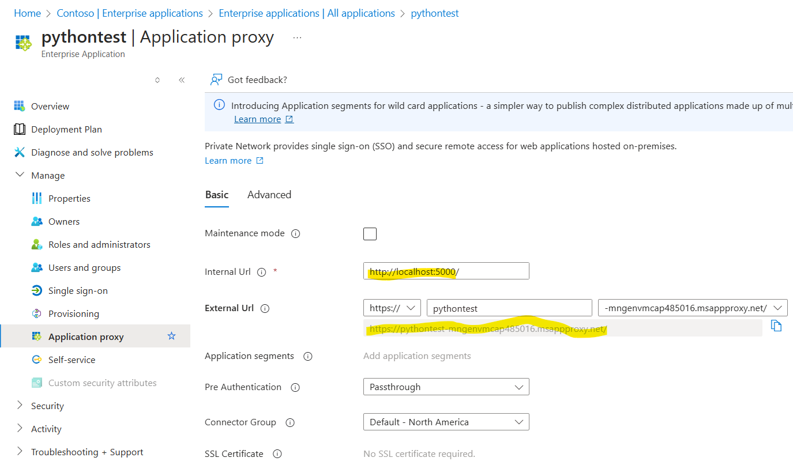
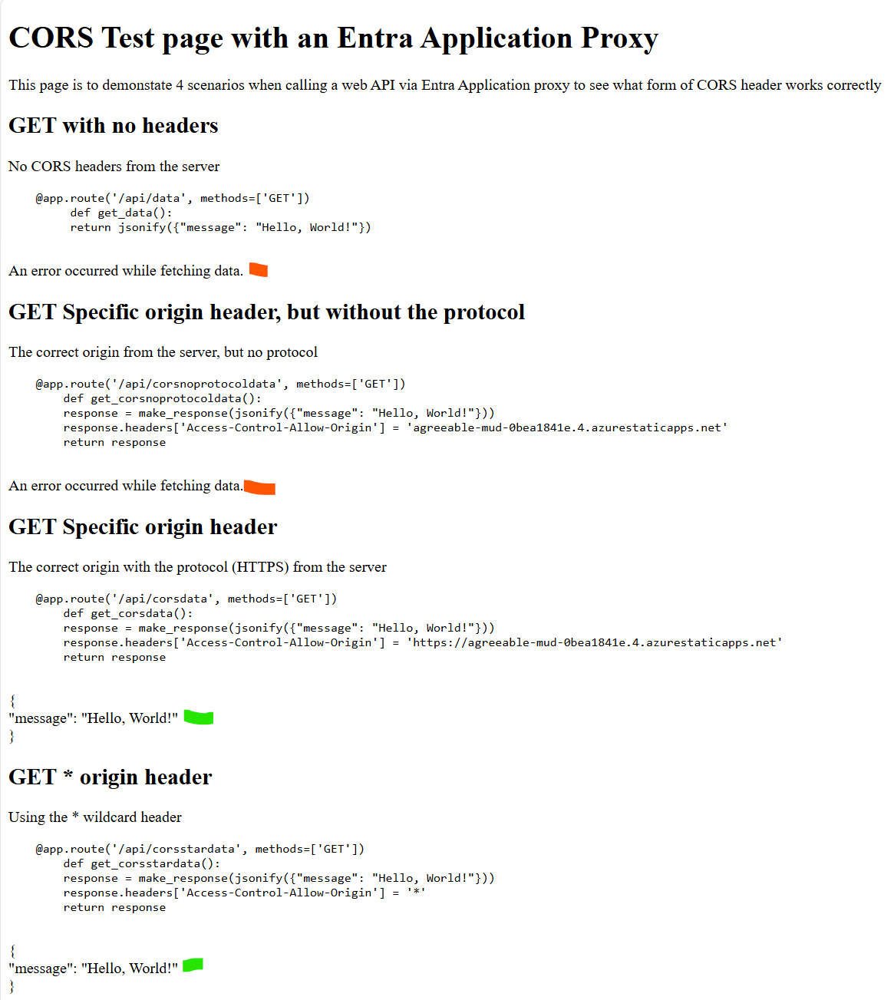
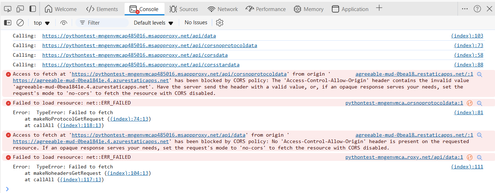

# CORS With Entra App Proxy Demo
This repo is a worked example of what CORS settings are needed for an API exposed via Entra Application Proxy. [CORS](https://en.wikipedia.org/wiki/Cross-origin_resource_sharing) headers are needed when a web browser attempts to make calls to an origin other than itself. This is a security mechanism.

For an on-premise web API, [Entra Application Proxy](https://learn.microsoft.com/en-us/entra/identity/app-proxy/overview-what-is-app-proxy) is one of the mechanisms by which the web API can be exposed in a controlled manner. The use of Entra App Proxy creates a URL that an application may use to automatically route to the on-premise API - even if that API has no public-facing API address itself.

This repo seeks to clarify exactly what needs to be done to get the combination of a web app, the App Proxy and API working together.

## The problem
If a single-page web application (SPA) built in the likes of React or Angular needs to call APIs that are not hosted from the same origin that served the SPA, then connections to these APIs will be refused. This means that applications must either host all of their needed APIs or (in the case of CORS), some configuration created that tells the browser that the web API is happy to accept requests from specific origins. Note it is for the API to define which origins from which it is willing to accept requests.

## The Approach
This repo takes the approach of augmenting the on-premise web API to add the correct CORS headers to responses. There may be other approaches, but adding the headers in the API is the simplest approach.

## The Demo
This demo has three components:
1. The on-premise web API. For this, Flask Python has been chosen, though it could be anything.
2. The Entra Application Proxy. The client part of this needs to be installed on the PC hosting the web API above.
3. A sample web page that makes calls to the API, using the Entra Application Proxy's URL

## The API
This exposes 4 test API endpoints to illustrate the different variation of CORS headers. The Python code is shown below:

```python
from flask import Flask, jsonify, make_response
from flask_cors import CORS

app = Flask(__name__)
#CORS(app)

@app.route('/api/data', methods=['GET'])
def get_data():
    return jsonify({"message": "Hello, World!"})

@app.route('/api/corsdata', methods=['GET'])
def get_corsdata():
    response = make_response(jsonify({"message": "Hello, World!"}))
    response.headers['Access-Control-Allow-Origin'] = 'https://agreeable-mud-0bea1841e.4.azurestaticapps.net'
    return response

@app.route('/api/corsnoprotocoldata', methods=['GET'])
def get_corsnoprotocoldata():
    response = make_response(jsonify({"message": "Hello, World!"}))
    response.headers['Access-Control-Allow-Origin'] = 'agreeable-mud-0bea1841e.4.azurestaticapps.net'
    return response

@app.route('/api/corsstardata', methods=['GET'])
def get_corsstardata():
    response = make_response(jsonify({"message": "Hello, World!"}))
    response.headers['Access-Control-Allow-Origin'] = '*'
    return response

if __name__ == '__main__':
    app.run(debug=True)
```

As can be seen above, this sample utilises the *Access-Control-Allow-Origin* header only. It could be extended to use one of the other headers for more granular control.

This API runs on-premise (not deployed to Azure)

## The Entra Application Proxy
This is configiured in the Entra part of the Azure portal and a connection created. This then allows for the installation of the proxy on the PC which provides a tunnel to the PC for it to accept HTTP requests using the Entra Proxy's URL. This URL will be used by the browser application.


## The Sample web page
Whilst most customers will use a framework such as React or Angular, for simplicity a simple HTML application has been chosen. This can then by quickly hosted on an [Azure Static Web App](https://learn.microsoft.com/en-us/azure/static-web-apps/overview) very easily.

The code for the application is:
````html
<!DOCTYPE html>
<html lang="en">
<head>
    <meta charset="UTF-8">
    <meta name="viewport" content="width=device-width, initial-scale=1.0">
    <title>CORS Test Example</title>
</head>
<body>
    <h1>CORS Test page with an Entra Application Proxy</h1>
    <p>This page is to demonstate 4 scenarios when calling a web API via Entra Application proxy to see what form of CORS header works correctly</p>
    
    <h2>GET with no headers</h2>
    <p>No CORS headers from the server</p>
    <pre>
    @app.route('/api/data', methods=['GET'])
         def get_data():
         return jsonify({"message": "Hello, World!"})    
    </pre>
    <div id="noresponse"></div>

    <h2>GET Specific origin header, but without the protocol</h2>
    <p>The correct origin from the server, but no protocol</p>
    <pre>
    @app.route('/api/corsnoprotocoldata', methods=['GET'])
        def get_corsnoprotocoldata():
        response = make_response(jsonify({"message": "Hello, World!"}))
        response.headers['Access-Control-Allow-Origin'] = 'agreeable-mud-0bea1841e.4.azurestaticapps.net'
        return response   
    </pre>
    <div id="noprotocolresponse"></div>

    <h2>GET Specific origin header</h2>
    <p>The correct origin with the protocol (HTTPS) from the server</p>
    <pre>
    @app.route('/api/corsdata', methods=['GET'])
        def get_corsdata():
        response = make_response(jsonify({"message": "Hello, World!"}))
        response.headers['Access-Control-Allow-Origin'] = 'https://agreeable-mud-0bea1841e.4.azurestaticapps.net'
        return response   
    </pre>
    <div id="specificresponse"></div>

    <h2>GET * origin header</h2>
    <p>Using the * wildcard header</p>
    <pre>
    @app.route('/api/corsstardata', methods=['GET'])
        def get_corsstardata():
        response = make_response(jsonify({"message": "Hello, World!"}))
        response.headers['Access-Control-Allow-Origin'] = '*'
        return response   
    </pre>
    <div id="starresponse"></div>

    <script>
        // Functions to make the GET requests
        function makeSpecificGetRequest() {
            const url = 'https://pythontest-mngenvmcap485016.msappproxy.net/api/corsdata';
            console.log('Calling: ', url);
            fetch(url)
                .then(response => response.json())
                .then(data => {
                    // Display the response data on the page
                    document.getElementById('specificresponse').innerText = JSON.stringify(data, null, 2);
                })
                .catch(error => {
                    console.log('Error: ', error);
                    document.getElementById('specificresponse').innerText = 'An error occurred while fetching data.';
                });
        }

        function makeNoProtocolGetRequest() {
            const url = 'https://pythontest-mngenvmcap485016.msappproxy.net/api/corsnoprotocoldata';
            console.log('Calling: ', url);
            fetch(url)
                .then(response => response.json())
                .then(data => {
                    // Display the response data on the page
                    document.getElementById('noprotocolresponse').innerText = JSON.stringify(data, null, 2);
                })
                .catch(error => {
                    console.log('Error: ', error);
                    document.getElementById('noprotocolresponse').innerText = 'An error occurred while fetching data.';
                });
        }

        function makeStarGetRequest() {
            const url = 'https://pythontest-mngenvmcap485016.msappproxy.net/api/corsstardata';
            console.log('Calling: ', url);
            fetch(url)
                .then(response => response.json())
                .then(data => {
                    // Display the response data on the page
                    document.getElementById('starresponse').innerText = JSON.stringify(data, null, 2);
                })
                .catch(error => {
                    console.log('Error: ', error);
                    document.getElementById('starresponse').innerText = 'An error occurred while fetching data.';
                });
        }

        function makeNoheadersGetRequest() {
            const url = 'https://pythontest-mngenvmcap485016.msappproxy.net/api/data';
            console.log('Calling: ', url);
            fetch(url)
                .then(response => response.json())
                .then(data => {
                    // Display the response data on the page
                    document.getElementById('noresponse').innerText = JSON.stringify(data, null, 2);
                })
                .catch(error => {
                    console.log('Error: ', error);
                    document.getElementById('noresponse').innerText = 'An error occurred while fetching data.';
                });
        }

        function callAll() {
            makeNoheadersGetRequest();
            makeNoProtocolGetRequest();
            makeSpecificGetRequest();
            makeStarGetRequest();
        }
        
        // Make the GET requests when the page loads
        window.onload = callAll;

    </script>
</body>
</html>
````
The code makes 4 attempts to call the API:
1. with no CORS headers
2. with the correct endpoint (the AD application proxy) - but with no protocol
3. the correct endpoint with the HTTPS protocol
4. Wildcard

## Results
With the web page deployed to an Azure Static Web site, below is the response:


looking at the dev tools in the browser confirms the CORS issues:


# Conclusion
In order for an application hosted in a browser to effectively use an on-premise web API via Entra Application Proxy, the fastest approach is to augment the returned headers on the API to be that of the origin hosting the web app - including its protocil. For example *Access-Control-Allow-Origin: https://agreeable-mud-0bea1841e.4.azurestaticapps.net/*

The use of the wildcard for this header is really to be discouraged as it bypasses all of the controls.

The main challenge is the knowledge of the origin's host name is needed at the API to add the right header. This could also be by-passed by configuring a custom domain for the hosting URL of the web application that needs to call the API. This will mean that the CORS header added to the API will be more stable over time. For static web apps, this is disussed [here](https://learn.microsoft.com/en-us/azure/static-web-apps/custom-domain)


